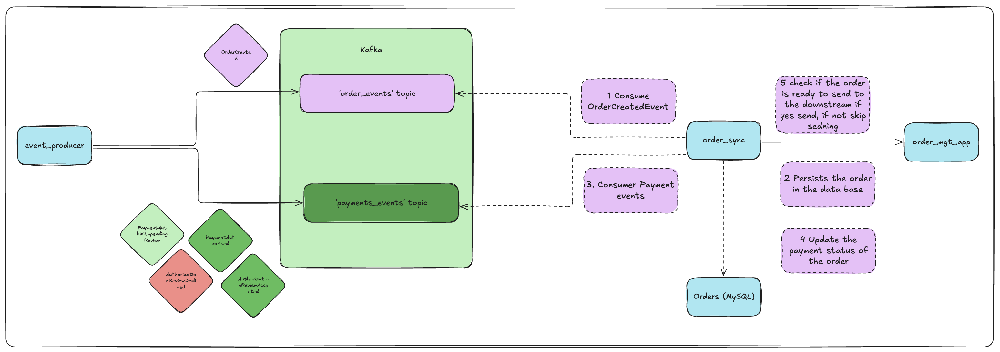

# An event pipeline for synchronize data between two systems using event sourcing

### Introduction

This project demonstrates an event-driven, event-sourcing system designed to handle order and payment events in a scalable fashion.
This event pipeline connect two systems , the event producer application represents the system which is the origin pronts for a few different types of events. The order related events are published in to `order_events` channel and payment related events are published it to `payments_events`.


### System Overview
Apache Kafka: Used as the central message hub for event intake and distribution, enabling decoupled communication between different parts of the application.

Node.js: Serves as the event producer and consumer, interfacing with Kafka to send and receive events.

MySQL: Acts as the persistent storage for event data, storing the current state of orders including their creation, payment status, and other relevant attributes. ( MySQL has been used for simplysity, but can replace with more horizoantally scalable database)

### Components
**Kafka**: Handles messaging and event distribution.

**Zookeeper**: Manages Kafka's state and configuration.

**MySQL Database**: Stores order data and state changes.

**Node.js Applications**:

**event_producer**: Generates and sends events to Kafka to both `order_events` and `payments_events` topics.

**order_sync_app**: Listens to Kafka topics for events and processes them and use event sourcing to create a mterialised view.

**order_mgt_app**: Eventually get the final state of the materialised view of the given order.




## Running the system locally.

### Prerequisites
- Docker and Docker Compose
- Node.js and npm

#### Instructions
##### 1. Clone the Repository
```
git clone 
cd yourrepository
```
##### 2.Start Kafka and MySQL using Docker Compose
Ensure Docker is running, then execute:
```bash
docker-compose up -d
```
This command starts Kafka, Zookeeper, and MySQL services defined in the docker-compose.yml file. These services are configured to expose necessary ports to the host machine, making them accessible Node.js application.

##### 3. Initialize the MySQL Database
Connect to your MySQL instance:
```
docker exec -it mysql mysql -uroot -prootpassword
```

Create the database and the table
```SQL
CREATE DATABASE IF NOT EXISTS event_synchronization;
USE event_synchronization;
CREATE TABLE orders (
    order_id VARCHAR(255) PRIMARY KEY,
    order_status VARCHAR(50),
    payment_status VARCHAR(50),
    review_status VARCHAR(50),
    ready_to_send BOOLEAN DEFAULT FALSE
);
```

##### 3. Initialize Kafka topics

```bash
docker-compose exec kafka kafka-topics --create --topic order_events --bootstrap-server localhost:9092 --partitions 1 --replication-factor 1
docker-compose exec kafka kafka-topics --create --topic payment_events --bootstrap-server localhost:9092 --partitions 1 --replication-factor 1
```

##### 4. Start the order_mgt_app

```
cd order_mgt_app

npm install
node server.js 
```

##### 5. Start the order_sycn app

```
cd ../order_sync

npm run dev
```


##### 5. Produce events

```
cd ../event_producer
npm install
```

*To send order created event* : `node producer.js o  <order_id>`

**Order created**
```JSON
{
    "eventType": "ORDER",
    "orderId": "order123",
    "orderStatus" : "CREATED",
    "timestamp": "2025-04-05T02:26:30.265Z"
}
```

*To send payment authorised event* : `node producer.js pa  <order_id>`

**Payment Authorized**
```JSON
{
    "eventType": "PAYMENT",
    "orderId": "order123",
    "paymentStatus" : "PAYMENT_AUHTORIZED",  
    "timestamp": "2025-04-05T02:26:31.265Z"
}
```

*To send payment selected for manual review event* : `node producer.js par <order_id>`

**Payment Selected For Fraud Review**
```JSON
{
    "eventType": "PAYMENT",
    "orderId": "order123",
    "paymentStatus" : "PAYMENT_AUTH_WITHPENDING_REVIEW",  
    "timestamp": "2025-04-05T02:26:32.265Z"
}
```

*To send fraud review accepted event* : `node producer.js paa <order_id>`

**Payment Fraud Review Accepted**
```JSON
{
    "eventType": "PAYMENT",
    "orderId": "order123",
    "paymentStatus" : "AUTHORIZATION_REVIEW_ACCEPTED",  
    "timestamp": "2025-04-05T02:26:30.265Z"
}
```

*To send fraud review declined event* : `node producer.js pad <order_id>`

**Payment Fraud Review Declined**
```JSON
{
    "eventType": "PAYMENT",
    "orderId": "order123",
    "paymentStatus" : "AUTHORIZATION_REVIEW_DECLINED",  
    "timestamp": "2025-04-05T02:26:30.265Z"
}
```


