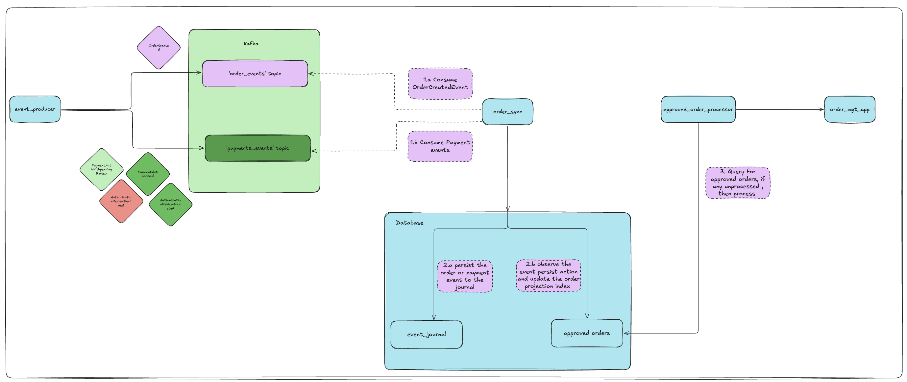
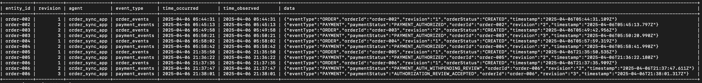
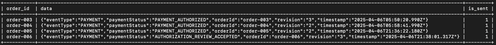
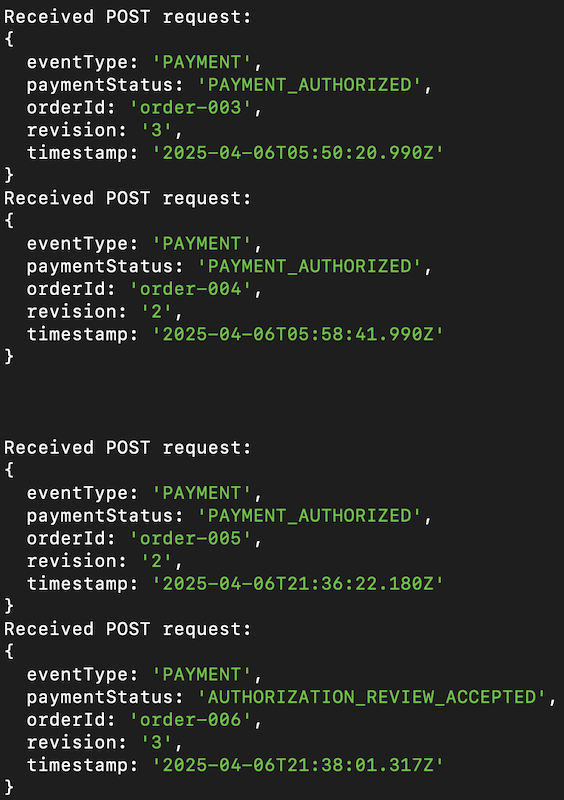

# Event-Sourced Data Synchronization System

### Introduction

This project demonstrates an event-driven, event-sourcing system designed to handle order and payment events in a scalable fashion.
This event pipeline connect two systems , the event producer application represents the system which is the origin pronts for a few different types of events. The order related events are published in to `order_events` channel and payment related events are published it to `payments_events`.

This design provides following benifits

#### 1. Guaranteed Data Integrity

**No Data Loss**: The architecture ensures that all events are captured and stored as immutable records in the event_journal. This approach guarantees that no data is lost, providing a robust foundation for event handling and state management.

#### 2. Enhanced System Flexibility

**Replayability**: The event_journal meticulously records every change that occurs within the system. This comprehensive logging enables the replaying of events to restore or analyze the system state at any point in time, enhancing debugging and system recovery processes.

#### 3. Comprehensive Audit Trail

**Built-in Audit Trail**: Each entry in the event_journal acts as a precise historical record of all changes, providing a built-in audit trail. This feature is invaluable for compliance and monitoring, offering clear insights into the sequence and nature of all system activities.

#### 4. Versatile Data Handling

**Multiple Projections**: The system is designed to support multiple projections, allowing data to be reshaped and aggregated in various forms to meet evolving requirements. This flexibility ensures that the system can adapt to future needs without significant reengineering.


### System Overview
**Apache Kafka**: Used as the central message hub for event intake and distribution, enabling decoupled communication between different parts of the application.

**Node.js**: Serves as the event producer and consumer, interfacing with Kafka to send and receive events.

**MySQL**: Acts as the persistent storage for event data, storing the current state of orders including their creation, payment status, and other relevant attributes. ( MySQL has been used for simplysity, but can replace with more horizoantally scalable database)

### Components
**Kafka**: Handles messaging and event distribution.

**Zookeeper**: Manages Kafka's state and configuration.

**MySQL Database**: Stores order data and state changes.

- **event_journal table**: Store the events in an immutable fashion, these events do not get updated by any process.
- **approved_orders**: Store the approved orders when the business rules are met to be qulified as a an approved order. This is a projection from the event_journal.

**Node.js Applications**:

**event_producer**: Generates and sends events to Kafka to both `order_events` and `payments_events` topics.

**order_sync_app**: Listens to Kafka topics for events and processes them and use event sourcing to create a mterialised view.

**approved_order_processor**: This application periodically query the `approved_orders` table to check if there are unsent approved orders exists, if exists it send to towards `order_mgt_app`.

**order_mgt_app**: Eventually get the final state of the materialised view of the given order.




## Running the system locally.

### Prerequisites
- Docker and Docker Compose
- Node.js and npm

#### Instructions
##### 1. Clone the Repository
```
git clone https://github.com/KalpaD/event-sourcing.git
cd event-sourcing
```
##### 2.Start Kafka and MySQL using Docker Compose
Ensure Docker is running, then execute:
```bash
docker-compose up -d
```
This command starts Kafka, Zookeeper, and MySQL services defined in the docker-compose.yml file. These services are configured to expose necessary ports to the host machine, making them accessible for Node.js applications.

##### 3. Initialize the MySQL Database
Connect to your MySQL instance:
```
docker exec -it mysql mysql -uroot -prootpassword
```

Create the database and the table
```SQL
CREATE TABLE event_journal (
    entity_id VARCHAR(32) NOT NULL,
    revision INT NOT NULL DEFAULT 0,
    agent TEXT NOT NULL,
    event_type VARCHAR(256) NOT NULL,
    time_occurred TIMESTAMP WITH TIME ZONE NOT NULL,
    time_observed TIMESTAMP WITH TIME ZONE NOT NULL,
    data JSONB NOT NULL,
    PRIMARY KEY (entity_id, revision)
    );

CREATE TABLE approved_orders (
    order_id VARCHAR(32) NOT NULL,
    data JSON NOT NULL,
    PRIMARY KEY (order_id)
    );
```

##### 4. Initialize Kafka topics

```bash
docker-compose exec kafka kafka-topics --create --topic order_events --bootstrap-server localhost:9092 --partitions 1 --replication-factor 1
docker-compose exec kafka kafka-topics --create --topic payment_events --bootstrap-server localhost:9092 --partitions 1 --replication-factor 1
```

##### 5. Start the order_mgt_app

```
cd order_mgt_app

npm install
node server.js 
```

##### 6. Start the order_sycn app

```
cd ../order_sync

npm run dev
```

##### 7. Start the approved_order_processor app


##### 8. Produce events

```
cd ../event_producer
npm install
```

*To send order created event* : `node producer.js o  <order_id> <revision>`

**Order created**
```JSON
{
    "eventType": "ORDER",
    "orderId": "order123",
    "revision": 1,
    "orderStatus" : "CREATED",
    "timestamp": "2025-04-05T02:26:30.265Z"
}
```

*To send payment authorised event* : `node producer.js pa  <order_id> <revision>`

**Payment Authorized**
```JSON
{
    "eventType": "PAYMENT",
    "orderId": "order123",
    "revision": 2,
    "paymentStatus" : "PAYMENT_AUHTORIZED",  
    "timestamp": "2025-04-05T02:26:31.265Z"
}
```

*To send payment selected for manual review event* : `node producer.js par <order_id> <revision>`

**Payment Selected For Fraud Review**
```JSON
{
    "eventType": "PAYMENT",
    "orderId": "order123",
    "revision": 2, // only one of PAYMENT_AUHTORIZED and PAYMENT_AUTH_WITHPENDING_REVIEW occur for one payment.
    "paymentStatus" : "PAYMENT_AUTH_WITHPENDING_REVIEW",  
    "timestamp": "2025-04-05T02:26:32.265Z"
}
```

*To send fraud review accepted event* : `node producer.js paa <order_id> <revision>`

**Payment Fraud Review Accepted**
```JSON
{
    "eventType": "PAYMENT",
    "orderId": "order123",
    "revision": 3,
    "paymentStatus" : "AUTHORIZATION_REVIEW_ACCEPTED",  
    "timestamp": "2025-04-05T02:26:30.265Z"
}
```

*To send fraud review declined event* : `node producer.js pad <order_id> <revision>`

**Payment Fraud Review Declined**
```JSON
{
    "eventType": "PAYMENT",
    "orderId": "order123", 
    "revision": 3, // only one of AUTHORIZATION_REVIEW_ACCEPTED and AUTHORIZATION_REVIEW_DECLINED occur for one payment.
    "paymentStatus" : "AUTHORIZATION_REVIEW_DECLINED",  
    "timestamp": "2025-04-05T02:26:30.265Z"
}
```

##### 9. Check the database 

**event_journal table**



**approved_orders**



**order_mgt_app console**


